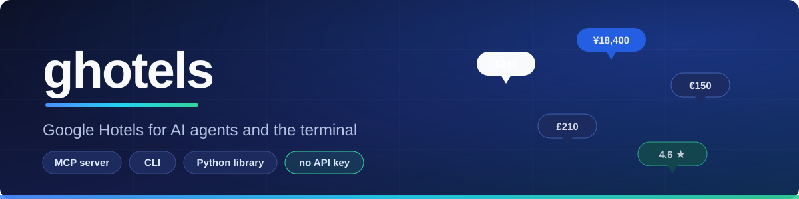
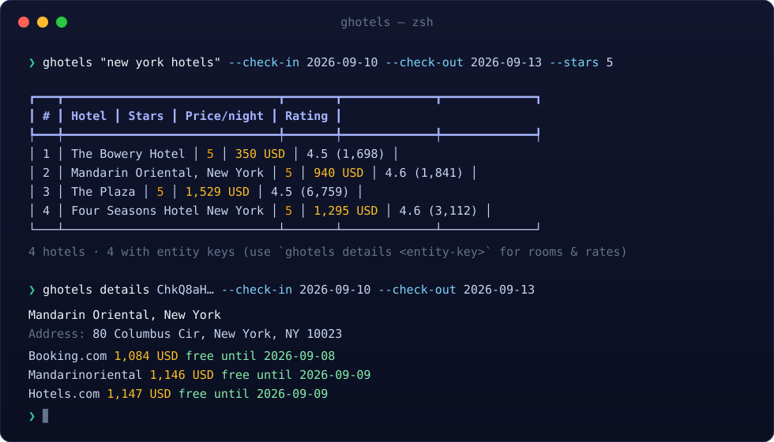
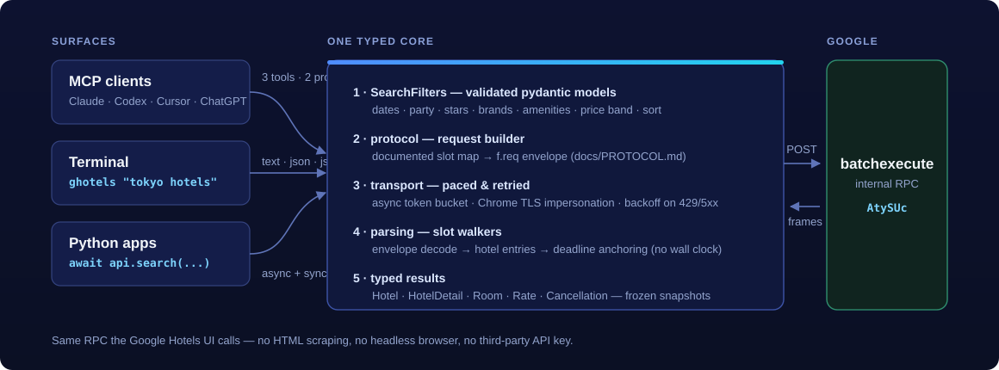

<p align="center">
  
</p>

<h1 align="center">ghotels</h1>

<p align="center"><strong>Give your AI agent live hotel data — no API key, no scraping.</strong></p>

<p align="center">
  An MCP server, CLI, and typed Python library that talk directly to Google Hotels'
  internal <code>batchexecute</code> RPC — the same call the Google Hotels UI makes.
</p>

<p align="center">
  <a href="https://pypi.org/project/ghotels/"></a>
  <a href="https://github.com/alexechoi/google-hotels-mcp/actions/workflows/test.yml"></a>
  <a href="https://pypi.org/project/ghotels/"></a>
  <a href="https://github.com/alexechoi/google-hotels-mcp/pkgs/container/google-hotels-mcp"></a>
  <a href="./LICENSE"></a>
</p>

<p align="center">
  <a href="#quick-start">Quick start</a> ·
  <a href="#mcp-tools">MCP tools</a> ·
  <a href="#cli">CLI</a> ·
  <a href="#python-api">Python API</a> ·
  <a href="./docs/PROTOCOL.md">Protocol docs</a> ·
  <a href="./CONTRIBUTING.md">Contributing</a>
</p>

> `ghotels` is a ground-up, actively maintained rebuild of
> [him229/stays](https://github.com/him229/stays), which pioneered this approach but is
> no longer maintained — see [Acknowledgements](#acknowledgements).

## Why ghotels?

| | |
|---|---|
| ⚡ **Fast** | One RPC per search — no page rendering, no headless browser, no third-party proxy |
| 🔑 **No API key** | Talks to the same internal endpoint the Google Hotels UI uses |
| 🤖 **MCP-native** | Three read-only tools, two prompts, one config resource; stdio and streamable HTTP |
| 🧰 **Three surfaces** | `pipx install ghotels` gets you the MCP server, the CLI, and the Python library |
| 🛡️ **Engineered, not scripted** | `mypy --strict`, `ruff` on `ALL` rules, async token-bucket rate limiting, typed error taxonomy, live-verified test suite |
| 📖 **Documented protocol** | The reverse-engineered wire format lives in [docs/PROTOCOL.md](./docs/PROTOCOL.md), not in tribal knowledge |

## Quick start

```bash
# 1. Install (pipx keeps it isolated and on your PATH)
pipx install ghotels

# 2. Register the MCP server with your client
ghotels setup claude        # Claude Code / Claude Desktop
ghotels setup codex         # OpenAI Codex CLI
ghotels setup chatgpt       # prints remote-connector instructions

# 3. Restart your client, then ask:
```

> *"Find me a 4-star hotel in Tokyo for Sep 22–26 under $150 a night."*
>
> *"Compare rooms, rates, and cancellation for the top 5 hotels near the Louvre."*
>
> *"Show me pet-friendly refundable stays in Austin next weekend."*

Prefer the terminal? The CLI speaks the same engine:

```bash
ghotels "tokyo hotels" --check-in 2026-09-22 --check-out 2026-09-26 --stars 4 --price-max 150
```

<p align="center">
  
</p>

## How it works

<p align="center">
  
</p>

Every surface funnels through one typed core: validated filters are encoded
by a [documented slot map](./docs/PROTOCOL.md) into the `f.req` envelope,
posted through a Chrome-impersonated, token-bucket-paced transport, and the
response frames are walked back into frozen pydantic models. Cancellation
deadlines are anchored to your check-in date — parsing never reads the wall
clock, so results are reproducible.

## MCP tools

| Tool | Use it for | RPC cost |
|------|-----------|----------|
| **`search_hotels`** | Discovery: browse and filter by city, stars, price, brand, amenities. **Start here.** | 1 |
| **`get_hotel_details`** | One hotel's rooms, per-provider rates, and cancellation policies. Needs an `entity_key` from a search. | 1 |
| **`search_hotels_with_details`** | Compare rooms/rates/cancellation across the top N hotels in one call. | 1 + N |

All three return one canonical envelope (`ok`, `kind`, `query`, `count`,
`results`), and bad arguments come back as corrective error messages that
list the valid options — the calling model can fix itself without a retry
loop. The server also ships two prompts (`choosing-a-tool`,
`compare-hotels-in-city`) and a live config resource at
`resource://google-hotels-mcp/configuration`.

<details>
<summary><strong><code>search_hotels</code> parameters</strong></summary>

| Parameter | Type | Notes |
|-----------|------|-------|
| `query` *(required)* | string | `"tokyo hotels"`, `"Hilton Paris"` |
| `check_in` / `check_out` | `YYYY-MM-DD` | Omit both for flexible dates |
| `adults` / `children` / `child_ages` | int / int / list[int] | One age (0–17) per child |
| `currency` | ISO 4217 | `USD` (default), `EUR`, `GBP`, `JPY`, … |
| `sort_by` | enum | `RELEVANCE`, `LOWEST_PRICE`, `HIGHEST_RATING`, `MOST_REVIEWED` |
| `hotel_class` | list[int] | e.g. `[4, 5]` |
| `amenities` | list | `POOL`, `WIFI`, `SPA`, `PET_FRIENDLY`, `KID_FRIENDLY`, … |
| `brands` | list | `HILTON`, `MARRIOTT`, `HYATT`, `IHG`, `ACCOR`, … |
| `min_guest_rating` | float | `3.5`, `4.0`, or `4.5` |
| `free_cancellation` / `eco_certified` / `special_offers` | bool | Refundable / eco / deals only |
| `price_min` / `price_max` | int | Per-night band in the selected currency |
| `property_type` | enum | `HOTELS` (default) or `VACATION_RENTALS` |
| `max_results` | int | Cap (1–25) |

</details>

<details>
<summary><strong><code>get_hotel_details</code> parameters</strong></summary>

| Parameter | Type | Notes |
|-----------|------|-------|
| `entity_key` *(required)* | string | From a prior `search_hotels` result |
| `check_in` / `check_out` *(required)* | `YYYY-MM-DD` | Rate plans are date-keyed |
| `adults` / `children` / `child_ages` | int / int / list[int] | Occupancy affects pricing |
| `currency` | ISO 4217 | Labels the returned rates |

</details>

<details>
<summary><strong><code>search_hotels_with_details</code> parameters</strong></summary>

Everything `search_hotels` takes (dates required), plus:

| Parameter | Type | Notes |
|-----------|------|-------|
| `max_hotels` | int | Top-N to enrich (default 5, hard cap 15). Per-hotel failures come back inline instead of aborting the batch. |

</details>

## CLI

`ghotels` routes a bare query straight to search — `ghotels "paris hotels"`
just works. Subcommands:

| Command | Purpose |
|---------|---------|
| `ghotels search <query>` | List-view search (one RPC) |
| `ghotels details <entity_key>` | Rooms / rates / cancellation for one hotel |
| `ghotels enrich <query>` | Search + parallel detail fetch for the top N |
| `ghotels mcp` | Stdio MCP server (what clients spawn) |
| `ghotels mcp-http` | Streamable-HTTP MCP server (dev / Docker) |
| `ghotels setup {claude\|codex\|chatgpt}` | Register with an MCP client |

```bash
# Filters compose; enums are case-insensitive
ghotels search "london hotels" \
    --check-in 2026-09-22 --check-out 2026-09-26 \
    --stars 4 --stars 5 --amenity POOL --brand HILTON \
    --price-max 300 --sort-by LOWEST_PRICE

# Machine-readable output
ghotels "rome hotels" --format json     # one envelope
ghotels "rome hotels" --format jsonl    # one record per line
```

## Python API

Async-first, with a synchronous facade that reuses one HTTP session:

```python
import asyncio
from datetime import date

from ghotels import AsyncGoogleHotels, Location, SearchFilters, SortBy, StayDates


async def main() -> None:
    async with AsyncGoogleHotels() as api:
        hotels = await api.search(
            SearchFilters(
                location=Location(query="tokyo hotels"),
                dates=StayDates(check_in=date(2026, 9, 22), check_out=date(2026, 9, 26)),
                star_classes=[4, 5],
                sort_by=SortBy.LOWEST_PRICE,
            )
        )
        best = hotels[0]
        print(best.name, best.price and best.price.amount)

        detail = await api.details(
            best.entity_key,
            dates=StayDates(
                check_in=date(2026, 9, 22),
                check_out=date(2026, 9, 26),
            ),
        )
        for room in detail.rooms:
            for rate in room.rates:
                print(rate.provider, rate.price, rate.cancellation.kind.value)


asyncio.run(main())
```

```python
# Synchronous — same API, no event loop to manage
from ghotels import GoogleHotels, Location, SearchFilters

with GoogleHotels() as api:
    for hotel in api.search(SearchFilters(location=Location(query="berlin hotels")))[:5]:
        print(hotel.name, hotel.rating and hotel.rating.score)
```

`search_with_details` fans out detail lookups concurrently and reports
per-hotel failures with a `retryable` flag instead of aborting the batch.
Everything public is exported from the top-level `ghotels` package and fully
typed (`py.typed`).

## Configuration

All knobs are environment variables:

| Variable | Default | Purpose |
|----------|---------|---------|
| `GHOTELS_RPS` | `10` | Rate limit toward Google (requests/second, token bucket) |
| `GHOTELS_TIMEOUT` | `30` | Per-request timeout (seconds) |
| `GHOTELS_MCP_DEFAULT_ADULTS` | `2` | Default party size |
| `GHOTELS_MCP_DEFAULT_CURRENCY` | `USD` | Fallback currency |
| `GHOTELS_MCP_DEFAULT_SORT_BY` | `RELEVANCE` | Default sort |
| `GHOTELS_MCP_MAX_RESULTS` | *unset* | Cap list-view results |
| `GHOTELS_MCP_DEFAULT_MAX_HOTELS` | `5` | Default enrich N (hard cap 15) |

## Docker

```bash
# Published multi-arch image (amd64 + arm64)
docker run --rm -p 8000:8000 ghcr.io/alexechoi/google-hotels-mcp:latest

# Or with compose
docker compose --profile prod up      # published image + healthcheck
docker compose --profile dev up --build
```

The container serves streamable-HTTP MCP on `:8000`. A bare `GET /mcp`
returns 405/406 by design — the transport requires
`Accept: application/json, text/event-stream`.

## Development

```bash
git clone https://github.com/alexechoi/google-hotels-mcp.git
cd google-hotels-mcp
make install-dev    # uv sync --extra dev
make check          # ruff format --check + ruff check + mypy --strict + pytest
make test-live      # end-to-end against the real endpoint (network)
```

The offline suite (180+ tests) runs against live-captured fixtures and
includes byte-parity goldens for the request encoder. Wire-format details
live in [docs/PROTOCOL.md](./docs/PROTOCOL.md). See
[CONTRIBUTING.md](./CONTRIBUTING.md) for the dev loop and PR conventions.

## Acknowledgements

`ghotels` exists because of two projects:

- **[stays](https://github.com/him229/stays)** by Himank Yadav did the
  original reverse engineering of the Google Hotels `batchexecute` RPC and
  proved this approach end to end. It is, at the time of writing, **no longer
  maintained** — the last activity was April 2026 and community fix PRs have
  gone unreviewed since — which is the direct reason this project exists.
  `ghotels` is a fresh, independently written implementation (not a fork)
  that re-derives the protocol from stays' documented findings, folds in the
  fixes that upstream never merged, and stays under active maintenance.
- **[fli](https://github.com/punitarani/fli)** by Punit Arani pioneered the
  direct-`batchexecute` technique for Google Flights that inspired stays in
  the first place.

## Disclaimer

This project is not affiliated with, endorsed by, or sponsored by Google.
It uses an unofficial, undocumented interface that may change or break at
any time; use it responsibly and respect Google's terms of service and rate
limits (the built-in limiter defaults to 10 requests/second).

## License

[MIT](./LICENSE) © Alex Choi
